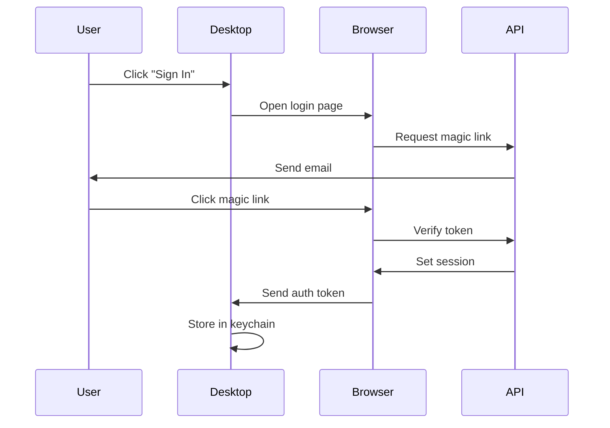

## Overview

The Cap API supports multiple authentication methods depending on your use case:

- **Session cookies** - For web application
- **Bearer tokens** - For desktop app and API integrations
- **Authorization headers** - For custom domains and commercial licenses

## Authentication Methods

### Session Cookies (NextAuth)

The web application uses NextAuth.js for session management.

#### Login Flow

1. User navigates to login page
2. Enters email address
3. Receives magic link via email
4. Clicks link to authenticate
5. Session cookie is set automatically

#### Session Configuration

Sessions are configured in `packages/database/auth/auth-options.ts`.

**Default session duration:** 30 days

### Bearer Tokens

For programmatic access, use Bearer tokens in the Authorization header.

#### Request Format

```bash
curl https://cap.so/api/video/analytics?videoId=123 \
  -H "Authorization: Bearer <your_token>"
```

#### Desktop App Authentication

The desktop app stores authentication tokens securely:

- **macOS:** Keychain
- **Windows:** Credential Manager
- **Linux:** Secret Service API

### Authorization Headers

Some endpoints use custom authorization headers:

#### Custom Domain Verification

```typescript
headers: {
  authorization: z.string()
}
```

#### License Activation

```typescript
headers: {
  licensekey: z.string(),
  instanceid: z.string()
}
```

## Protected Endpoints

### Desktop Routes

All desktop routes require authentication:

```typescript:packages/web-api-contract/src/desktop.ts
const protectedContract = c.router(
  {
    submitFeedback: { /* ... */ },
    getUserPlan: { /* ... */ },
    getS3Config: { /* ... */ },
  },
  {
    baseHeaders: z.object({ authorization: z.string() }),
    commonResponses: { 
      401: z.object({ error: z.string().or(z.boolean()) }) 
    },
  }
);
```

### Video Endpoints

Video management endpoints require authentication:

- `DELETE /video/delete`
- `GET /video/analytics`
- `GET /video/transcribe/status`

### Notification Endpoints

Notification endpoints require authentication:

- `GET /notifications`

## Error Responses

### 401 Unauthorized

Returned when authentication is missing or invalid:

```json
{
  "error": "Unauthorized"
}
```

or

```json
{
  "error": true,
  "auth": false
}
```

### 403 Forbidden

Returned when the user lacks permissions:

```json
{
  "message": "Insufficient permissions"
}
```

## Obtaining Authentication Tokens

### For Desktop App

The desktop app handles authentication automatically:

1. User clicks "Sign In"
2. Opens browser to login page
3. Completes authentication
4. Token is sent back to desktop app
5. Token stored securely in system keychain

### For API Integrations

Currently, Cap does not provide public API tokens for third-party integrations. This feature is planned for future releases.

## Session Management

### Check Session Status

For web sessions, NextAuth provides:

```typescript
import { getServerSession } from "next-auth/next";
import { authOptions } from "@cap/database/auth/auth-options";

const session = await getServerSession(authOptions);

if (!session) {
  // Not authenticated
}
```

### Client-Side Session

```typescript
import { useSession } from "next-auth/react";

const { data: session, status } = useSession();

if (status === "authenticated") {
  // User is logged in
}
```

## Security Best Practices

<Warning>
  **Never commit authentication tokens to version control**
  
  Store tokens in:
  - Environment variables
  - System keychains
  - Secure credential stores
</Warning>

### Token Storage

<AccordionGroup>
  <Accordion title="Desktop Apps">
    Use platform-specific secure storage:
    - macOS: Keychain Services
    - Windows: Credential Manager  
    - Linux: libsecret/gnome-keyring
  </Accordion>
  
  <Accordion title="Web Apps">
    Use secure cookies:
    - HttpOnly flag
    - Secure flag (HTTPS only)
    - SameSite=Lax or Strict
  </Accordion>
  
  <Accordion title="Server-Side">
    Store in environment variables:
    - Never hardcode tokens
    - Use `.env` files (excluded from git)
    - Rotate tokens regularly
  </Accordion>
</AccordionGroup>

## Commercial License Authentication

### Activate License

```bash
POST /api/commercial/activate
```

**Headers:**
```json
{
  "licensekey": "your-license-key",
  "instanceid": "unique-instance-id"
}
```

**Body:**
```json
{
  "reset": false
}
```

**Response:**
```json
{
  "message": "License activated",
  "expiryDate": 1735689600,
  "refresh": 86400
}
```

See `packages/web-api-contract/src/index.ts:122-136` for full schema.

## Testing Authentication

### Test Authenticated Endpoint

```bash
curl -X GET https://cap.so/api/desktop/plan \
  -H "Authorization: Bearer test-token" \
  -H "Content-Type: application/json"
```

**Expected response (authenticated):**
```json
{
  "upgraded": true,
  "stripeSubscriptionStatus": "active"
}
```

**Expected response (unauthenticated):**
```json
{
  "error": "Unauthorized"
}
```

## Authentication Flow Diagram



## Next Steps

<CardGroup cols={2}>
  <Card title="Videos API" icon="video" href="/api/videos">
    Learn about video endpoints
  </Card>
  <Card title="Notifications API" icon="bell" href="/api/notifications">
    Learn about notification endpoints
  </Card>
</CardGroup>